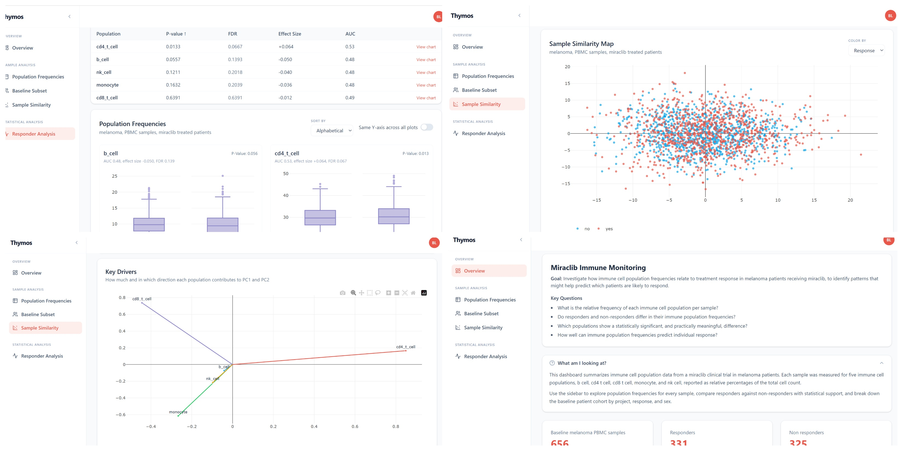
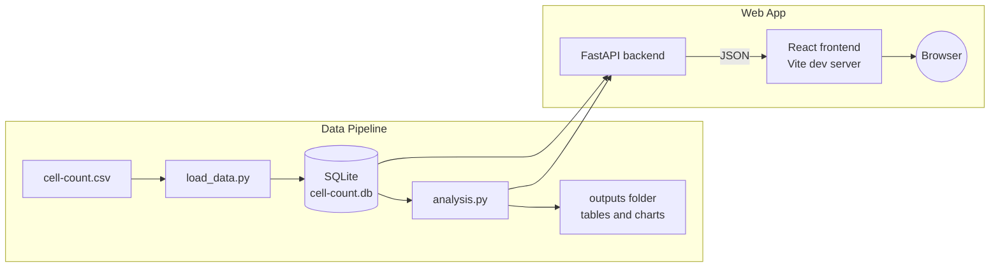
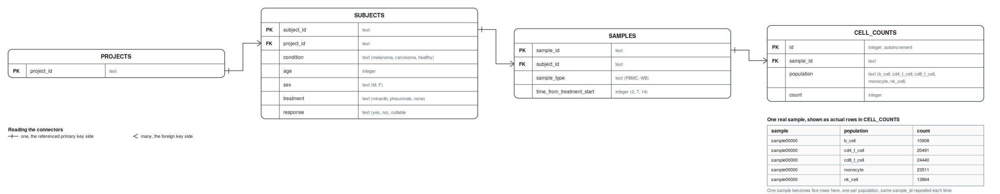

# Thymos: An Immune Cell Population Dashboard



A data pipeline and interactive dashboard for exploring immune cell population frequencies from clinical trial samples, and investigating how they relate to treatment response.

## Features

- Relative frequency calculation for every immune cell population across every sample
- Responder versus non-responder comparison with Mann-Whitney U tests, effect size, AUC, and Benjamini-Hochberg FDR correction
- PCA based sample similarity map and a loadings chart showing which populations drive the strongest patterns of variation
- Dynamic filtering by condition, treatment, sample type, and timepoint across every view
- Searchable, paginated sample browser supporting comma separated and range based sample ID search
- CSV export from every major view
- A pytest suite covering the core analysis logic

## Architecture



The pipeline and the web app share the same database and the same analysis.py functions, so nothing is calculated two different ways in two different places.

## Quick Start

```
make setup
make pipeline
make dashboard
```

**make setup** installs Python and Node dependencies.

**make pipeline** builds the SQLite database from cell-count.csv and runs the full analysis, saving tables and charts to an outputs folder.

**make dashboard** starts the FastAPI backend on port 8000 and the React frontend on port 5173.

```
make test
```

Runs the pytest suite.

### Accessing the dashboard in Codespaces

Once `make dashboard` is running, Codespaces forwards port 5173 automatically. Open it from the popup, or the Ports tab. To share the link, set that port's visibility to Public in the Ports tab, it defaults to private.

## Database Schema

Four tables, projects, subjects, samples, and cell_counts.



Populations are stored as rows in cell_counts rather than as fixed columns, so adding a new population later is an insert, not a schema change. Subject level fields, condition, age, sex, treatment, response, live on subjects rather than being repeated per sample, since they don't vary within a subject. response is nullable, it's only meaningful for subjects who received a treatment being evaluated.

Every table uses its natural identifier as the primary key. Foreign keys and indexes follow the real hierarchy, subjects reference projects, samples reference subjects, cell_counts reference samples.

**Scaling.** More projects, subjects, or samples are just more rows, no schema changes. A new cell population is more rows in cell_counts, not a new column. New subject or sample level attributes are additive columns. At real scale, hundreds of projects and millions of cell count rows, this would move to a server based database like PostgreSQL, the table structure itself would carry over unchanged.

## Code Structure

```
load_data.py                Schema creation and CSV loading
analysis.py                 Core analysis functions, statistics, PCA
conftest.py                 makes the project root importable for pytest
requirements.txt
Makefile

backend/
  main.py                   FastAPI app, all API endpoints
  schemas.py                Pydantic models and enums

frontend/
  src/
    hooks/useApiData.js      shared fetch, loading, and error state
    utils/csv.js              client side CSV export
    components/
      Layout.jsx, Sidebar.jsx, Header.jsx
      Breadcrumb.jsx, ExplainerBox.jsx, ExportButton.jsx, FilterBar.jsx
      Overview.jsx
      SummaryTable.jsx                      population frequencies
      ResponderBoxplot.jsx, FindingsTable.jsx    responder comparison
      BaselineSubset.jsx                     baseline cohort breakdown
      SamplePCA.jsx                          sample similarity and key drivers

tests/
  test_analysis.py
```

analysis.py is the single source of truth, the pipeline, the tests, and every API endpoint all call the same functions, nothing is calculated twice. FastAPI stays a thin layer, each endpoint connects, calls an analysis.py function, and returns a typed response, the actual logic lives in one place. Pydantic enums validate filter values before any query runs. The frontend shares one data fetching hook across every view instead of duplicating it per component.

## Testing

tests/test_analysis.py uses a small hand built fixture database, so expected values are known in advance and the suite runs in a few seconds. It covers the core calculations and the edge cases the analysis needs to handle correctly, empty results, missing comparison groups, and FDR correction across multiple populations.
